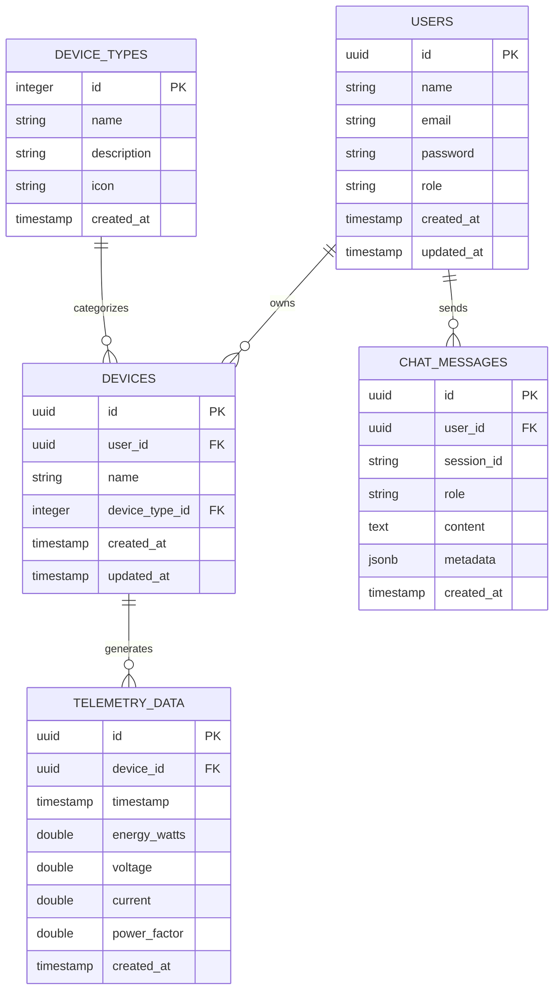

# Smart Home Energy Monitoring with Conversational AI

A full-stack application for monitoring and analyzing home energy consumption through natural language queries.

## Features

- 🔐 User authentication and authorization
- 📊 Real-time energy consumption visualization
- 💬 Natural language query interface
- 📈 Time-series data analysis
- 🐳 Dockerized deployment

## Tech Stack

- **Backend**: Node.js with Express
- **Database**: PostgreSQL with TimescaleDB extension
- **Frontend**: React with TypeScript
- **Authentication**: JWT
- **Containerization**: Docker & Docker Compose
- **API Documentation**: Swagger/OpenAPI

## Database Schema

### Entity Relationship Diagram



### Schema Details

#### Auth Service (MVP Implementation)

##### `users` Table (Active)
- Simple JWT-based authentication
- No refresh tokens initially
- Basic role-based access control

#### Telemetry Service

##### `device_types` Table
- Defines different types of devices (fridge, AC, etc.)
- Supports UI representation with icons
- Enables consistent categorization

##### `devices` Table
- Represents physical devices
- Links to device types and owners
- Tracks creation and updates

##### `telemetry_data` Table
- Time-series data storage
- Optimized with TimescaleDB hypertables
- Stores energy metrics
- Indexed for fast time-based queries

#### Chat Service

##### `chat_messages` Table
- Stores conversation history
- Supports both user and assistant messages
- Uses session_id to group messages
- Flexible metadata field for additional context

## Implementation Notes

### Authentication (MVP)
- Using stateless JWT tokens
- Simple token expiration (e.g., 24 hours)

### Database Design
- Schema is forward-compatible with future enhancements
- All foreign keys and relationships are maintained

## Project Structure

```
smart-home-energy-monitor/
├── backend/                 # Backend services
│   ├── auth-service/        # Authentication service
│   ├── telemetry-service/   # Telemetry data handling
│   └── chat-service/        # Conversational AI service
├── frontend/                # React frontend
├── docker-compose.yml       # Docker Compose configuration
└── README.md                # This file
```

## API Documentation

API documentation is available at `/api-docs` when the services are running.

## Getting Started

### Prerequisites

- Docker & Docker Compose
- Node.js (v18+)
- npm or yarn

### Installation

1. Clone the repository:
   ```bash
   git clone <repository-url>
   cd smart-home-energy-monitor
   ```

2. Copy the environment variables:
   ```bash
   cp .env.example .env
   ```

3. Start the services:
   ```bash
   docker-compose up -d
   ```

4. Access the application:
   - Frontend: http://localhost:3000
   - API Docs: http://localhost:3001/api-docs
   - Database: PostgreSQL on port 5432

## Development

### Running Tests

```bash
# Run tests for all services
npm test
```

### Generating Test Data

Use the provided script to generate test telemetry data:

```bash
python scripts/generate_telemetry.py
```

## License

MIT
